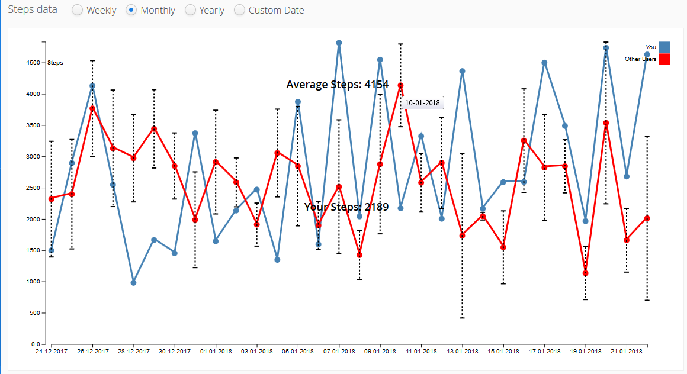
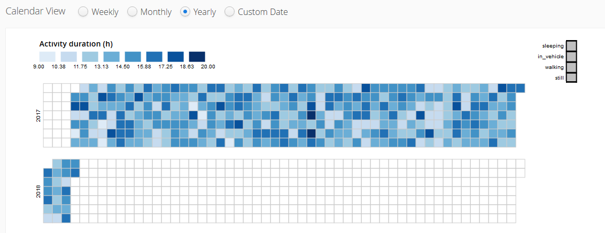

# qtrack

qTrack’s primary goal is to import user activity data from multiple
sources, merge, validate and visualize it to help the users compare
their progress with the peers and mean of all users in the database.
qTrack also aims to combine the activity data of the user with other
research disciplines to bring for new findings on human activity and
its effects.

Currently only fitness data provided by Google Fit is grabbed and
stored in the database.

## Overview

* User logs in using his google account and gives consent about sharing
his data
* qTrack requests the steps and the fitness data from google fit;
response is aggregated into 24h intervals
* Mean steps of all users are recalculated with the current user's step
values. Standard error is used for visualization, since it describes the
accuracy of the sample mean
* Step and activity data is stored in the MongoDB database with the
unique user id and the dates
* Query to the database is sent requesting the data for the selected
time interval -> sent in .json format to javascript
* Visualization in javascript using d3

See https://github.com/qbicsoftware/qtrack/blob/master/src/_README.md
for a more detailed README on the implementation itself.

## Setup

* Install the lastest version of MongoDB:
https://www.mongodb.com/download-center#community
* Run MongoDB:
  ```bash
  $ path/to/MongoDB/Server/3.x/bin/mongod --port 27017 --dbpath path/where/you/want/to/store/the/DB
  ```
    * Optional: Restore the database with some artificial values into
    your running MongoDB instance:
    ```bash
    $ path/to/MongoDB/Server/3.x/bin/mongorestore --drop --db trackFit TrackFit/database/trackFit
    ```
    * Otherwise the database and the collections will be constructed
    automatically
* Get some Maven Jetty plugin for your IDE & run the application with it
* qTrack should now run on http://localhost:8080/
* Note: By default qTrack creates some random data if there is no data
available via GoogleFit; this can be disabled in the DbConnector class
in the storeData function.

## Available Visualizations


### Visualization of steps data



### Visualization of activity data





